<div align="center">

  

  # 🎧 كتاب صوتي | Ketab Sawty

  ### **Turn Your Books & Documents into Intelligent Audiobooks**
  *حوّل كتبك ومستنداتك إلى كتب صوتية بضغطة زر*

  <p align="center">
    <a href="https://flutter.dev"></a>
    <a href="https://dart.dev"></a>
    <a href="https://bloclibrary.dev"></a>
    <a href="https://pub.dev/packages/hive"></a>
    <a href="#"></a>
  </p>

  <p align="center">
    <strong>Ketab Sawty</strong> is an all-in-one Flutter application designed to transform physical and digital reading materials into rich, narrated audiobooks. Featuring built-in offline Arabic OCR (Optical Character Recognition), PDF merging and compression, customizable Text-to-Speech (TTS) narration, and an interactive audiobook player.
  </p>

</div>

---

## 📑 Table of Contents

- [✨ Key Features](#-key-features)
- [📱 Screenshots & UI Showcase](#-screenshots--ui-showcase)
- [🏗️ System Architecture](#️-system-architecture)
- [🛠️ Tech Stack & Dependencies](#️-tech-stack--dependencies)
- [📂 Project Structure](#-project-structure)
- [🚀 Getting Started](#-getting-started)
- [⚙️ Configuration & Prerequisites](#️-configuration--prerequisites)
- [🌐 Internationalization & Accessibility](#-internationalization--accessibility)
- [🤝 Contributing](#-contributing)
- [📄 License](#-license)

---

## ✨ Key Features

### 📖 Document Ingestion & PDF Handling
- **Upload Existing PDFs**: Drag-and-drop or select any PDF file and automatically inspect metadata (title, author, total pages).
- **Camera Capture & Scanner**: Take pictures of physical book pages or select photos from your gallery.
- **Smart PDF Compilation**: Automatically bundle captured pages into a high-quality, lightweight, compressed PDF.

### 🔍 Offline Arabic OCR (Optical Character Recognition)
- **Tesseract OCR Integration**: Powered by `flutter_tesseract_ocr` with offline Arabic trained data (`ara.traineddata`).
- **Real-Time Extraction**: Extracts clean text page-by-page with live progress tracking and percent indicators.
- **Extracted Text Reader**: Clean typography with the custom Arabic *Tajawal* font for effortless reading.

### 🎙️ Text-to-Speech (TTS) Narration
- **Intelligent Speech Synthesis**: Seamlessly converts extracted text into natural audio using `flutter_tts`.
- **Word Progress Tracking**: Monitors word-level and sentence-level audio synchronization.
- **Multiple Voice Options**: Choose between different voices and pitch/rate settings.

### 🎵 Advanced Audiobook Player
- **Rich Playback Controls**: Play, pause, fast forward (10s), rewind (10s), and adjustable playback speed rates (0.5x, 1.0x, 1.5x, 2.0x).
- **Background Audio**: Smooth background playback using `just_audio`.
- **Cover Art & Bookmarks**: Save positions, add bookmarks, and favorite books for quick access.

### 📚 Personal Library & Favorites
- **Organized Storage**: Save books into Hive local database for instant offline access.
- **Tabbed Organization**: Filter your collection by *All*, *Completed*, or *Not Completed*.
- **Quick Favorites**: One-click hearting to keep essential audiobooks within reach.

### 🎨 Personalization & Theming
- **Dynamic Theming**: Instant switching between Light Mode, Dark Mode, and System Default.
- **Multilingual Support**: Fully localized in both Arabic (العربية - RTL) and English (LTR).

---

## 📱 Screenshots & UI Showcase

<div align="center">

### 🌟 App Walkthrough & Flow

| 1. Splash Screen | 2. Home Dashboard | 3. Upload PDF | 4. Book Metadata |
|:---:|:---:|:---:|:---:|
| 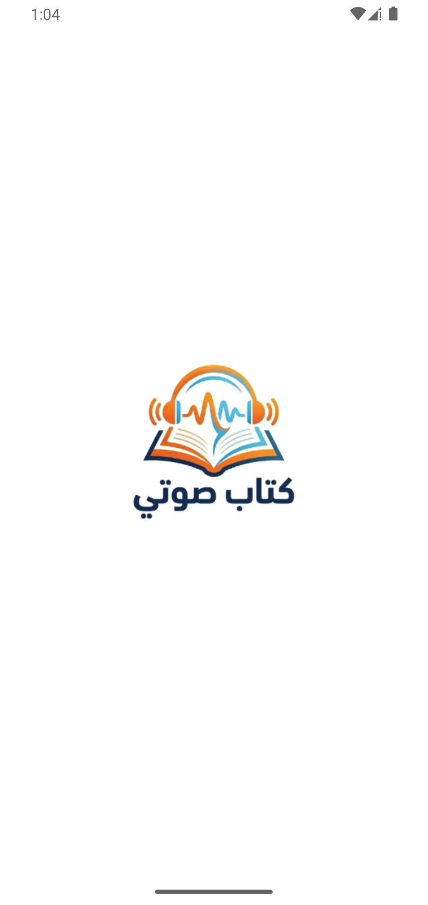 | 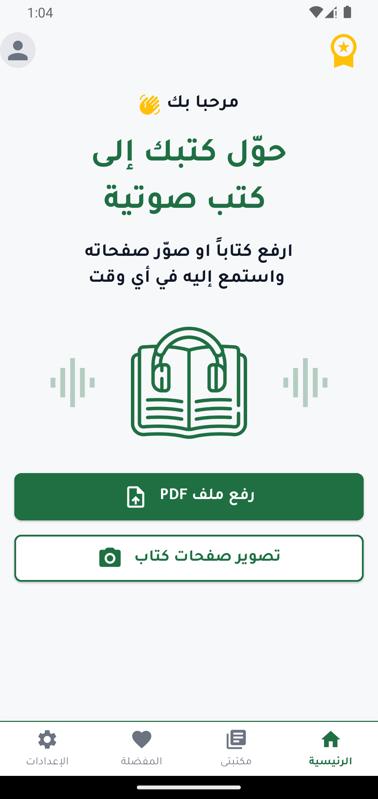 | 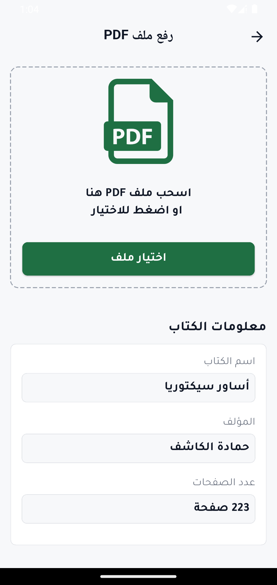 | 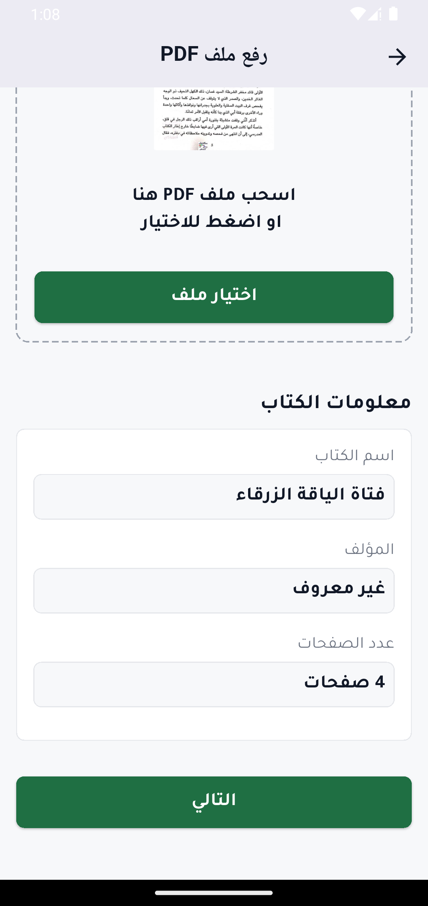 |
| *Branded onboarding* | *Audiobook creation hub* | *Document selection* | *Metadata validation* |

<br/>

| 5. OCR Processing | 6. Extracted Text Reader | 7. Audiobook Player |
|:---:|:---:|:---:|
| 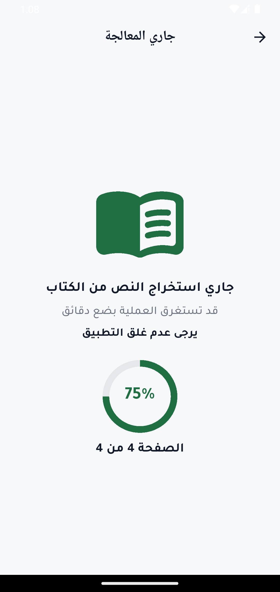 | 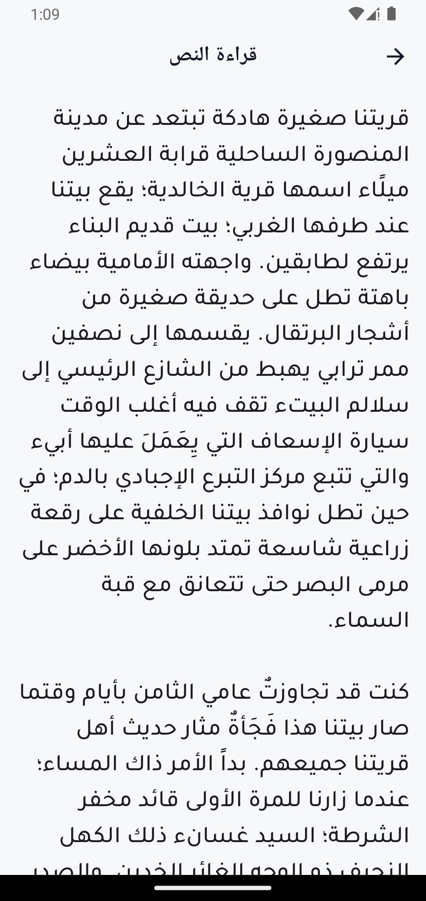 | 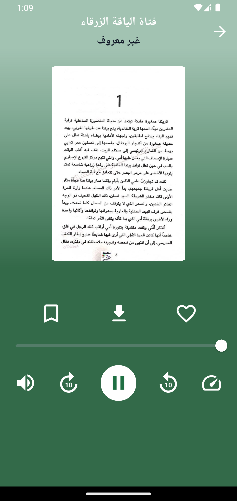 |
| *Real-time OCR progress* | *Clean Arabic text reading* | *Full playback controls* |

<br/>

| 8. Favorites | 9. My Library | 10. Settings | 11. About the App |
|:---:|:---:|:---:|:---:|
| 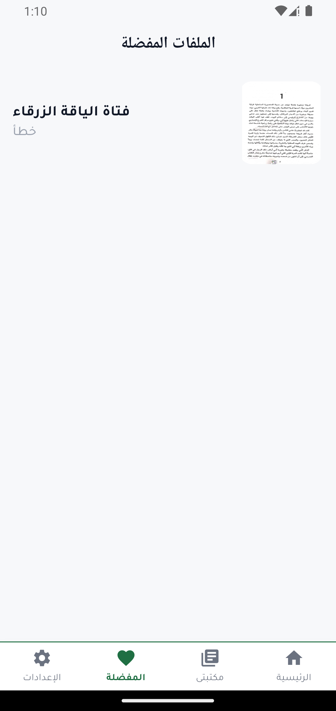 | 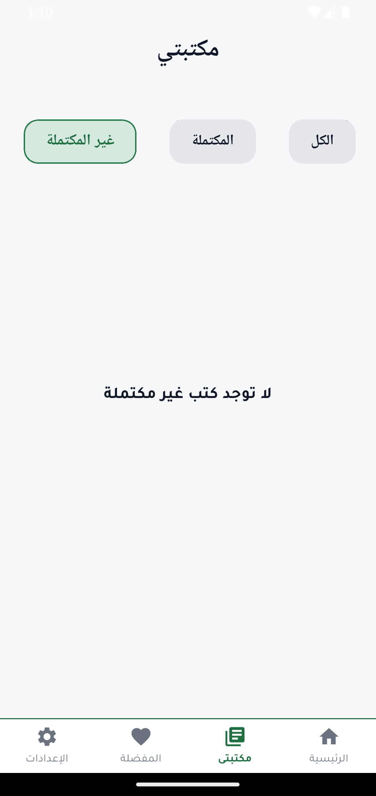 | 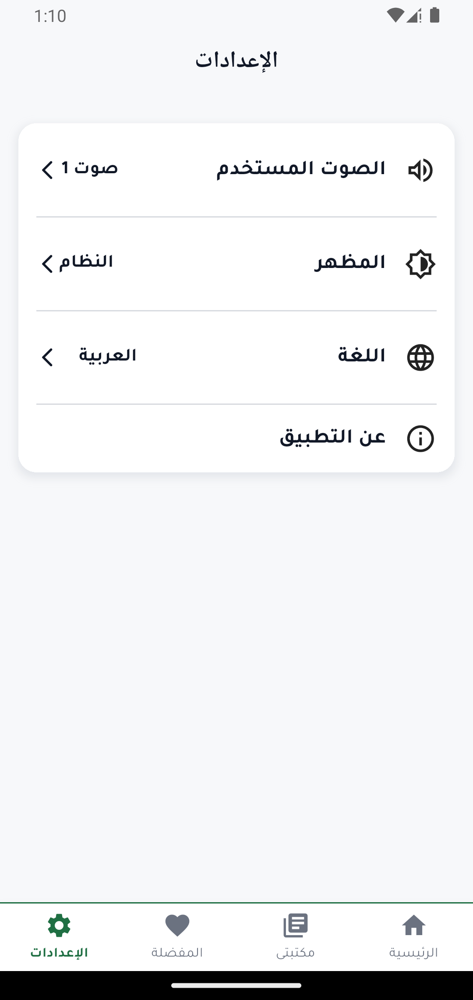 | 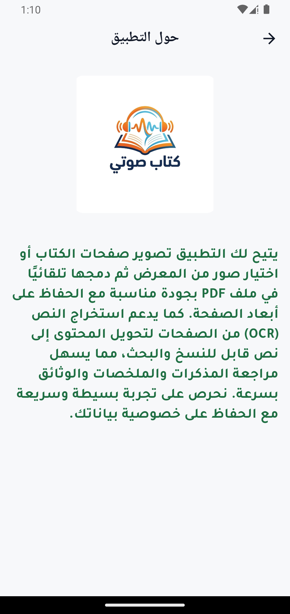 |
| *Favorited audiobooks* | *Filterable book lists* | *Theme, Voice & Language* | *Overview & privacy info* |

</div>

---

## 🏗️ System Architecture

The application is engineered strictly adhering to **Clean Architecture** principles and the **BLoC (Business Logic Component)** pattern:

```
lib/
├── core/                       # Core shared components across features
│   ├── utils/                  # Constants, Theme, Routes, DI, Localization helpers
│   ├── view/                   # Reusable shared UI widgets
│   └── view_model/             # Global Cubits (Theme, Language, Voice)
│
└── features/                   # Feature-based modular structure
    ├── home/                   # Document scanning, PDF processing, OCR & Audio Player
    ├── my_library/             # Local book library management & status filters
    ├── favorites/              # Favorited audiobooks management
    └── settings/               # App configuration & preferences
```

### Layer Breakdown per Feature:
- **Domain Layer**: Contains enterprise business logic: `Entities`, abstract `Repositories`, and granular single-responsibility `UseCases`.
- **Data Layer**: Contains `Models`, `DataSources` (Hive local storage, File APIs), and concrete `RepositoryImplementations`.
- **Presentation Layer**: Contains UI screens (`Pages`), reusable custom `Widgets`, and `Cubits` managing reactive states.

---

## 🛠️ Tech Stack & Dependencies

| Category | Technology / Package | Description |
|---|---|---|
| **Framework** | [Flutter](https://flutter.dev) & [Dart](https://dart.dev) | Cross-platform UI toolkit |
| **State Management** | [`flutter_bloc`](https://pub.dev/packages/flutter_bloc) | Predictable state management via Cubits |
| **Dependency Injection** | [`get_it`](https://pub.dev/packages/get_it) | Fast service locator for inversion of control |
| **Local Database** | [`hive`](https://pub.dev/packages/hive) & [`hive_flutter`](https://pub.dev/packages/hive_flutter) | Lightweight key-value NoSQL database |
| **Preferences** | [`shared_preferences`](https://pub.dev/packages/shared_preferences) | Key-value store for user preferences |
| **OCR & AI** | [`flutter_tesseract_ocr`](https://pub.dev/packages/flutter_tesseract_ocr) | Offline Tesseract OCR engine for Arabic/English |
| **Audio & TTS** | [`just_audio`](https://pub.dev/packages/just_audio), [`flutter_tts`](https://pub.dev/packages/flutter_tts) | Audio playback and Text-To-Speech synthesis |
| **PDF Tools** | [`syncfusion_flutter_pdf`](https://pub.dev/packages/syncfusion_flutter_pdf), [`pdfx`](https://pub.dev/packages/pdfx), [`pdf_combiner`](https://pub.dev/packages/pdf_combiner) | PDF generation, compression, and viewing |
| **Media & Files** | [`image_picker`](https://pub.dev/packages/image_picker), [`file_picker`](https://pub.dev/packages/file_picker) | Camera capture and document selection |
| **UI & UX** | [`flutter_screenutil`](https://pub.dev/packages/flutter_screenutil), [`toastification`](https://pub.dev/packages/toastification), [`animated_bottom_navigation_bar`](https://pub.dev/packages/animated_bottom_navigation_bar) | Responsive design, animated bars & notifications |
| **Localization** | [`flutter_localizations`](https://api.flutter.dev/flutter/flutter_localizations/flutter_localizations-library.html), [`intl`](https://pub.dev/packages/intl) | Multi-language & RTL support (Arabic / English) |

---

## 📂 Project Structure

```text
ketab_sawty/
├── android/                     # Native Android Gradle configuration
├── assets/
│   ├── fonts/                   # Tajawal Arabic Font family (Regular, Medium, Bold)
│   ├── icons/                   # App launcher icons & SVG assets
│   ├── screenshots/             # Application UI screenshots
│   ├── tessdata/                # Tesseract OCR Arabic trained dataset
│   └── tessdata_config.json     # Tesseract dataset mapping
├── lib/
│   ├── core/
│   │   ├── utils/               # AppTheme, AppRoutes, AppColors, ServiceLocator
│   │   ├── view/                # Custom text fields, nav bars, validators
│   │   └── view_model/          # ThemeCubit, LanguageCubit, VoiceCubit
│   ├── features/
│   │   ├── home/
│   │   ├── my_library/
│   │   ├── favorites/
│   │   └── settings/
│   ├── generated/               # Auto-generated localization files
│   ├── l10n/                    # intl_ar.arb & intl_en.arb strings
│   └── main.dart                # Application entrypoint & dependency bootstrap
├── pubspec.yaml                 # Dependencies and assets manifest
└── README.md                    # Project documentation
```

---

## 🚀 Getting Started

### Prerequisites
- [Flutter SDK](https://docs.flutter.dev/get-started/install) (version `3.9.0` or higher)
- [Dart SDK](https://dart.dev/get-dart) (version `3.9.0` or higher)
- [Android Studio](https://developer.android.com/studio) / VS Code with Flutter & Dart extensions
- Physical device or Emulator running Android 7.0+ (API level 24+)

### Installation

1. **Clone the repository:**
   ```bash
   git clone https://github.com/Ahmed-Moataz-glitch/Ketab-Sawty.git
   cd ketab_sawty
   ```

2. **Install dependencies:**
   ```bash
   flutter pub get
   ```

3. **Generate code (Hive adapters & localization):**
   ```bash
   dart run build_runner build --delete-conflicting-outputs
   ```

4. **Run the application:**
   ```bash
   flutter run
   ```

---

## ⚙️ Configuration & Prerequisites

### 🔤 Tesseract OCR Trained Data
The offline OCR functionality uses the trained data file located at `assets/tessdata/ara.traineddata`. Ensure this file is declared in `pubspec.yaml` under `flutter.assets`:
```yaml
flutter:
  assets:
    - assets/icons/
    - assets/tessdata_config.json
    - assets/tessdata/
```

### 📱 Android Gradle Settings
This project is configured for **Android Gradle Plugin (AGP) 8+**. If building on modern Gradle versions, subproject namespaces are dynamically assigned in `android/build.gradle.kts` to maintain compatibility with all legacy plugins.

---

## 🌐 Internationalization & Accessibility

Ketab Sawty is built with first-class internationalization support:
- 🇸🇦 **Arabic (العربية)**: Default locale with complete RTL (Right-to-Left) layout alignments and custom typography.
- 🇺🇸 **English**: Full LTR localization.

To add new translation strings, update `lib/l10n/intl_ar.arb` and `lib/l10n/intl_en.arb`, then run the Flutter Intl generator.

---

## 🤝 Contributing

Contributions are always welcome! If you'd like to improve the app:
1. Fork the Project
2. Create your Feature Branch (`git checkout -b feature/AmazingFeature`)
3. Commit your Changes (`git commit -m 'Add some AmazingFeature'`)
4. Push to the Branch (`git push origin feature/AmazingFeature`)
5. Open a Pull Request

---

## 📄 License

This project is licensed under the MIT License. See the [LICENSE](LICENSE) file for more details.

---

<div align="center">
  Developed with ❤️ by <strong>Ahmed Moataz</strong>
</div>
